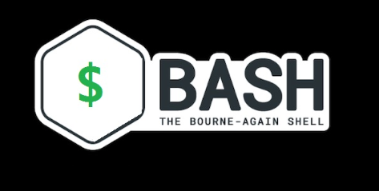

<h2 align="center">🛠 Technologies and Tools 🛠</h2>
 

&nbsp;

&nbsp;

&nbsp;

&nbsp;

&nbsp;

&nbsp;

&nbsp;

&nbsp;

&nbsp;

&nbsp;

 
<h2 align="center">🔥 GitHub Stats 🔥</h2>
<!-- https://github.com/anuraghazra/github-readme-stats -->
 

   
  

 
<h2 align="center">👽 Where to find me 👽</h2>
 
<!-- https://icons8.com -->

  
  
  
  
  

 

